<!-- Generated by tools/build_proposal.py. Edit proposal/sections, not this file. -->

# Catskills Micro-Compound Development Proposal

**Working repository edition - August 2026**

A staged woodland retreat organized around a compact principal home, shared courtyard, wellness bathhouse, detached accessory dwelling unit, guest sleeping cabin, and outdoor kitchen.

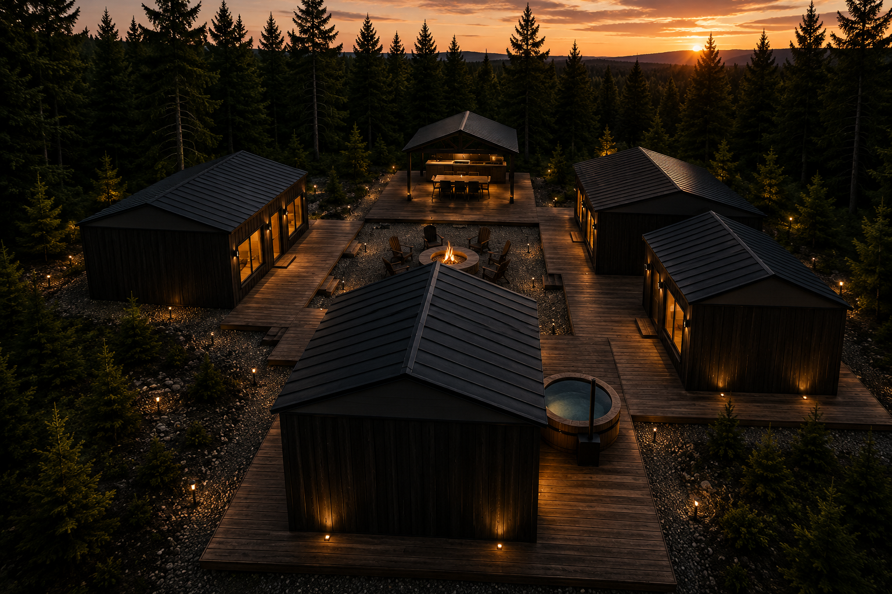

The central promise is simple: make the property useful after Stage 1, then add outdoor life, wellness, and guest capacity without relocating earlier work or abandoning a coherent final plan.

> **Planning status:** Conceptual feasibility and design document. Not a survey, construction drawing, zoning determination, septic design, engineering document, legal opinion, approval, or contractor bid.

---

## Executive overview

### Goal

Acquire a secluded, buildable Catskills parcel and develop a low-rise vacation compound in deliberate phases. The final arrangement gathers several small structures around a mostly flat firepit courtyard, with a continuous deck system providing circulation and outdoor living.

### Final concept

- A 24 x 20 ft principal compact home anchors the north edge.
- A 16 x 16 ft bathhouse sits to the west of the courtyard with sauna, shower, bathing, and toilet functions.
- A cold plunge and wood-fired hot tub join the bathhouse deck.
- A 22 x 20 ft full ADU adds an independently livable dwelling to the southeast.
- A 16 x 12 ft no-kitchen guest sleeping cabin fills the south-western gap.
- A covered 18 x 16 ft outdoor kitchen/bar closes the east side.
- A fixed central firepit and a clean, contiguous deck network tie the composition together.

### Development thesis

The entire Stage 8 layout should be validated before construction begins. Stage 1 can then establish the correct home location, utility capacity, access, finished-floor datum, and future trench routes. Later stages become additive projects rather than expensive corrections.

### Immediate decision gates

1. Verify that a candidate parcel can support the full occupancy, water, septic, access, and resource constraints.
2. Obtain written municipal feedback on the detached ADU, guest sleeping cabin, bathhouse, tubs, pavilion, and close compound layout.
3. Reconcile the conceptual geometry to an actual survey and topographic/site plan.
4. Refresh costs and decide which work is contractor-led, owner-built, or deferred.

---

## Sample property and site character

This proposal uses the prior listing for **Tbd Rider Hollow Road, Hardenburgh, NY 12406** as a feasibility example, not as a currently verified acquisition target.

| Attribute | Prior-proposal record |
|---|---|
| Approximate acreage | 15.7-16 wooded acres |
| Map pin | 42.102681, -74.523254 |
| Listing reference | Zillow property ID 32842779 |
| Prior asking price | $189,000; the legacy budget used a fixed $200,000 land allowance |
| Reported improvements | Driveway, leveled/excavated areas, engineered septic, and electric availability |
| Site character | Secluded woodland, rugged surrounding terrain, usable clearings, trails, and a seasonal stream |

The attributes are promising because existing access, a disturbed clearing, power, and an approved septic system can reduce early site-development cost. None should be relied on without documentary verification. In particular, obtain the septic permit and approved design flow, survey and easements, utility confirmation, potable-water feasibility, and current listing/title information.

The seasonal stream and mountain terrain make the site a useful stress test for Hardenburgh’s natural-resource rules. Acreage alone does not establish a buildable envelope.

[Archived Revision 3 proposal](../sources/prior-proposals/catskills_compound_development_proposal_rev3.pdf) contains the original listing summary and should be treated as project history, not current due diligence.

---

## Design principles

### Geometry first, imagery second

The site model is the spatial contract. Generative images may improve material realism, vegetation, weather, and atmosphere, but they may not move structures, change roof types, invent deck edges, or reverse east/west relationships.

### Design the end state before Stage 1

Every structure, utility route, and major deck connection should have a reserved location before the first foundation is placed. Early construction should preserve the later plan even if buildout takes many years.

### One courtyard, one circulation system

The compound should read as a coherent cluster around a mostly flat outdoor room. Deck additions use broad, straight, obvious connections. Avoid fragmented pads, hairline joins, decorative zigzags, and unnecessary retaining work.

### Small structures with complete jobs

Each building has a clear program: primary dwelling, wellness, independent secondary dwelling, guest sleeping, or outdoor cooking. The collection should not depend on ambiguous “shed” labels to avoid permits or occupancy rules.

### Shared architectural language

- Near-black or charred vertical wood siding
- Dark matte standing-seam gable roofs
- Warm cedar-toned decking
- Dark window frames and restrained glazing
- Warm interior light against a subdued woodland palette
- Simple, durable landscape and drainage choices

### Evidence before commitment

Legal assumptions, cost ranges, septic capacity, and site conditions remain explicit until supported. The proposal should make uncertainty visible and convert it into a question, test, or professional task.

---

## Master plan and spatial logic

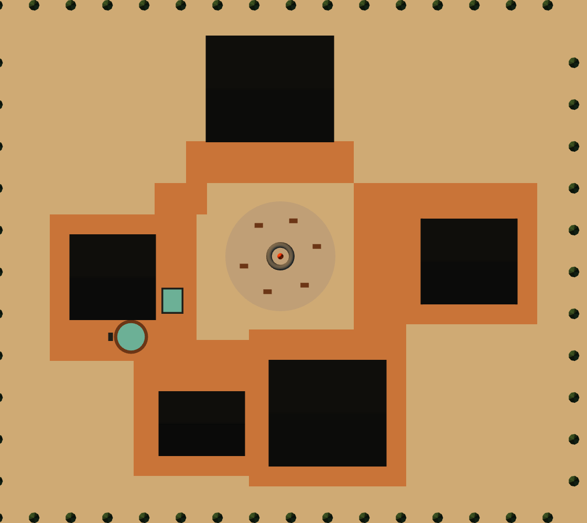

The current master geometry uses source coordinates in feet: +X east, +Z north, and +Y up. The displayed top-down and perspective images receive the same final horizontal mirror so the architectural view reads north up and east right.

| Element | Footprint / key location | Courtyard relationship |
|---|---|---|
| Principal home | 24 x 20 ft; source origin X=40, Z=72 | North edge; principal facade faces south |
| Firepit | Center X=54, Z=50; 10.5 ft gravel radius | Fixed center of the outdoor room |
| Bathhouse | 16 x 16 ft; origin X=14, Z=38 | West; east facade faces inward |
| Cold plunge | 4.2 x 5 ft; X=31.3, Z=39 | Immediately east of shower-side bathhouse wall |
| Hot tub | Center X=25.5, Z=34.6; radius 3.25 ft | South and slightly west of plunge |
| ADU | 22 x 20 ft; origin X=52, Z=10 | South-east, clear of firepit pad |
| Guest cabin | 16 x 12 ft; origin X=31, Z=12 | Between bathhouse and ADU |
| Outdoor kitchen | Approx. 18 x 16 ft; origin X=81, Z=41 | East; open bar face points west toward courtyard |

The top-down camera remains identical across all stages. Only visibility changes, allowing direct comparison without scale or framing drift. The exact polygons, stage visibility, and camera definitions live in [cameras-and-geometry.json](../sources/data/cameras-and-geometry.json).

The geometry is dimension-controlled concept work, not a surveyed site plan. It must ultimately be transformed into parcel coordinates and adjusted around actual grade, trees, rock, drainage, septic, well, access, and regulated resources.

---

## Component program

| Component | Intended program | Design boundary |
|---|---|---|
| Principal compact home | Approx. 480 sf with kitchen, full bath, living/sleeping space, heat pump, and full utilities | Establishes legal principal residence and service capacity; not a code-defined ≤400 sf tiny house. |
| Deck network | Phased outdoor circulation and living surface | Must remain contiguous, drain safely, handle snow, and preserve code-required guards, stairs, and building relationships. |
| Firepit courtyard | Flat gravel/stone pad, stone ring, later seating and low lighting | Avoid sunken construction; confirm fire restrictions, clearances, and insurance. |
| Bathhouse | 256 sf with sauna, shower, soaking tub, vanity/WC, and service zone | No sleeping or kitchen; plumbing, sauna, ventilation, egress, and occupancy require professional/code review. |
| Hot/cold bathing | Wood-fired hot tub and compact cold plunge | Integrate with bathhouse deck without blocking glazing; plan barriers/covers, bonding, drainage, and heater clearances. |
| Detached ADU | Approx. 440 sf complete dwelling with kitchen, bath, HVAC, and utilities | Approval path and relation to multiple-principal-building rule must be confirmed in writing. |
| Guest cabin | Approx. 192 sf no-kitchen sleeping building with small bath, HVAC, power, egress, and alarms | Treat as occupied permitted work; do not rely on a shed exemption. |
| Outdoor kitchen/bar | Covered open-air grill, smoker, prep, bar seating, light, and power | No sleeping use; confirm gas/solid-fuel, structure, electrical, and fire requirements. |

The component list defines intent, not fixed construction systems. Foundation type, utility strategy, structural framing, envelope assemblies, and equipment should be selected after site and code validation.

---

## Bathhouse basis of design

| True-coordinate plan | Conceptual cutaway |
|---|---|
| 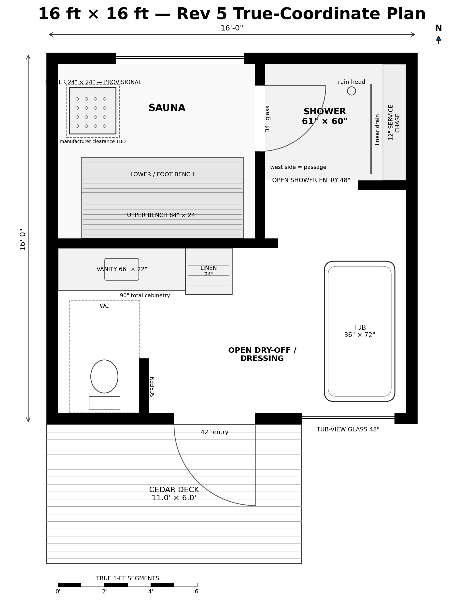 | 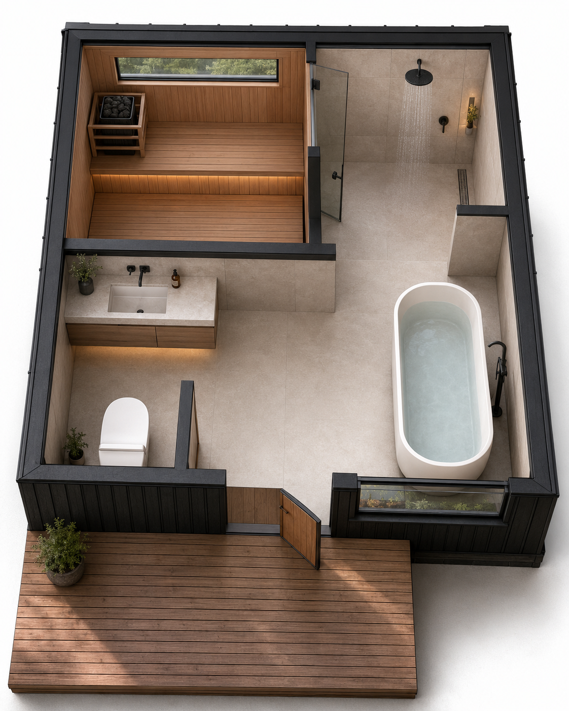 |

The 16 x 16 ft bathhouse is the most developed interior concept and should not be casually reoriented. In the accepted site model, its **east** sauna/shower facade faces the firepit courtyard. Sauna glazing occupies the northern part of that facade; the southern shower portion remains substantially solid. The main entry is on the opposite/back side and is reached by the wraparound deck.

At Stage 5, the cold plunge sits immediately east of the shower-side wall. The larger wood-fired hot tub sits south and slightly west of the plunge, overlapping the bathhouse in east-west dimension. The deck should envelop the building and both tubs.

The plan reserves sauna, shower, soaking tub, vanity/toilet, service space, and south entry. Heater model, clearances, guards, floor/drainage assembly, waterproofing, freeze protection, mechanical ventilation, plumbing load, glazing safety, egress, and pool/spa protections remain professional design tasks.

---

## Staged planning budget

The following ranges are inherited from the prior 2026 planning proposal. They are placeholders for scope comparison, not current bids. They include a fixed $200,000 land allowance and exclude financing, escalation between phases, major retaining work, septic expansion, and a possible $12,000-$35,000 well contingency.

| Stage | Scope | Contractor add | Contractor cumulative | Owner-builder add | Owner-builder cumulative |
|---:|---|---:|---:|---:|---:|
| Land | Land allowance | $200k | $200k | $200k | $200k |
| 1 | 480 sf principal home | $165k-$260k | $365k-$460k | $95k-$155k | $295k-$355k |
| 2 | Courtyard deck | $8k-$14k | $373k-$474k | $4k-$7k | $299k-$362k |
| 3 | Firepit pad and ring | $4k-$9k | $377k-$483k | $1.5k-$4k | $300.5k-$366k |
| 4 | Bathhouse and connecting deck | $155k-$225k | $532k-$708k | $82k-$125k | $382.5k-$491k |
| 5 | Seating, cold plunge, hot tub | $20k-$40k | $552k-$748k | $13k-$25k | $395.5k-$516k |
| 6 | 440 sf ADU and deck | $160k-$250k | $712k-$998k | $90k-$150k | $485.5k-$666k |
| 7 | Guest cabin and deck | $65k-$115k | $777k-$1.113M | $35k-$65k | $520.5k-$731k |
| 8 | Outdoor kitchen and final deck links | $45k-$80k | $822k-$1.193M | $25k-$45k | $545.5k-$776k |

Before any purchase or construction decision, replace these figures with dated local inputs for land closing, survey/title, design and approvals, driveway/site work, foundations, septic/well, utilities, structures, decks, equipment, contingency, insurance, tax, and escalation. Owner-builder ranges still assume licensed or specialized trades where required.

---

## Stage 1 - Principal compact home

Build the approximately 24 x 20 ft / 480 sf principal dwelling first. Include a kitchen, full bathroom, flexible living/sleeping area, heat pump, full utilities, and service capacity sized for later bathhouse and ADU loads.

| Fixed-frame plan | Illustrative high-fidelity view |
|---|---|
| 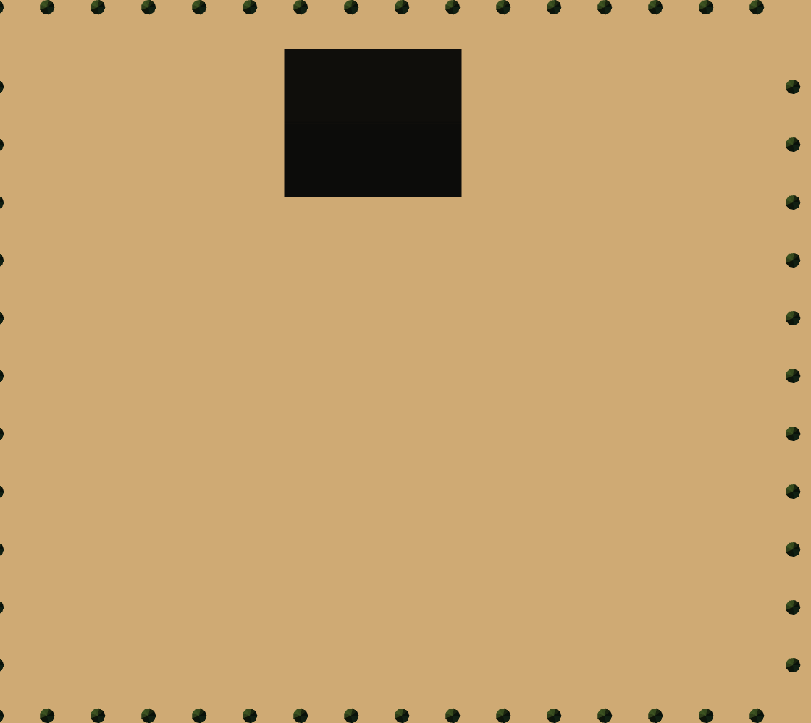 | 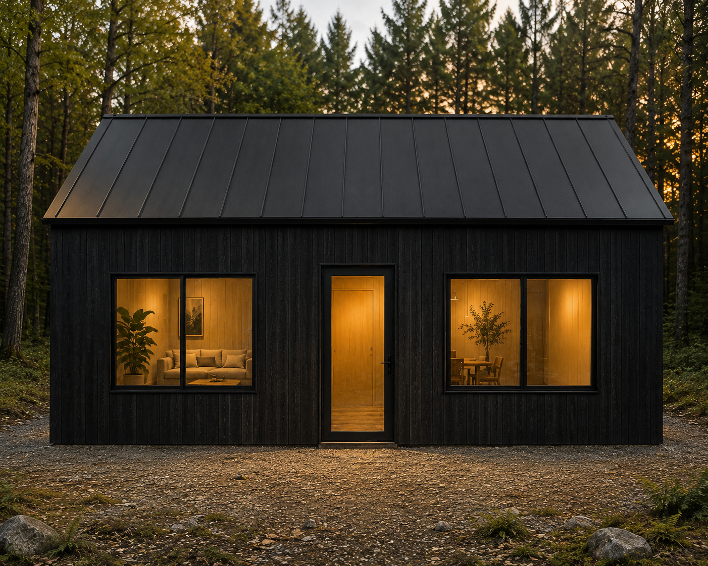 |

**Planning range:** contractor +$165k-$260k; owner-builder +$95k-$155k, plus land and due-diligence costs.

**Stage gate:** finalize the surveyed Stage 8 plan before locating this foundation. During trenching, install or reserve capped power, water, sanitary, and low-voltage routes toward future components where approved and practical.

---

## Stage 2 - Courtyard-facing deck

Add the first deck on the inward-facing side of the principal home. It establishes the outdoor floor datum and the northern edge of the future courtyard while the retreat remains simple and usable.

| Fixed-frame plan | Illustrative high-fidelity view |
|---|---|
| 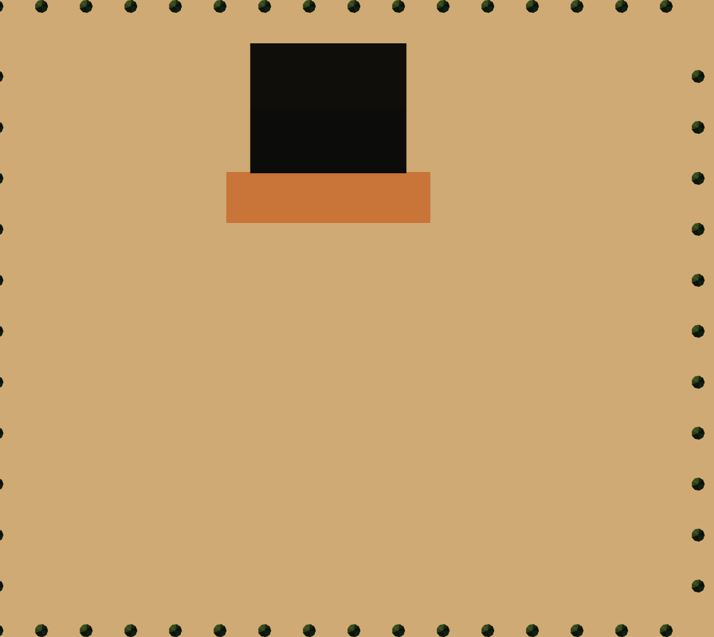 | 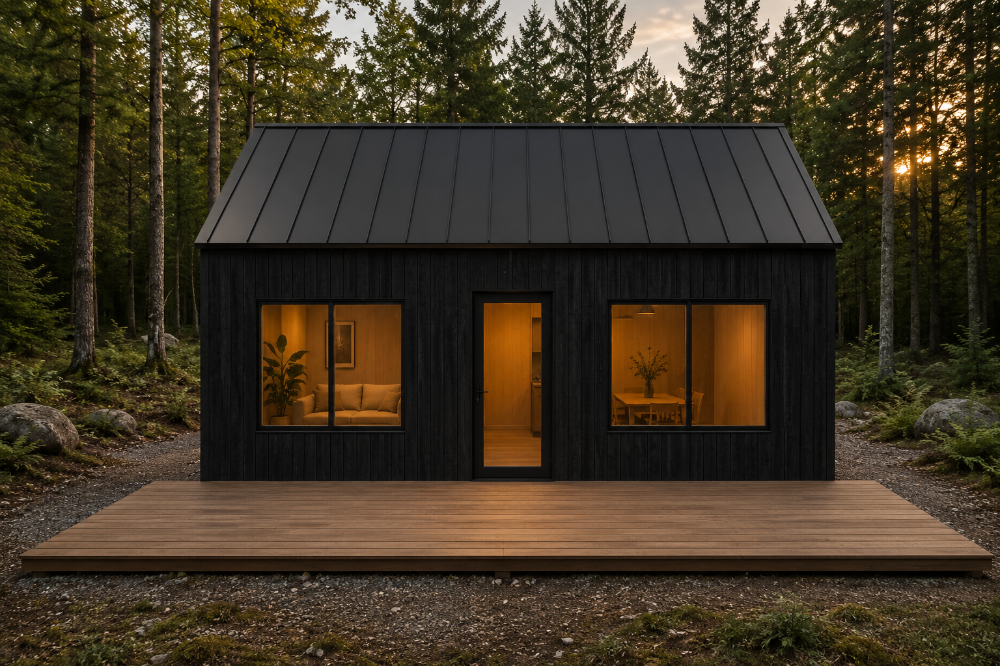 |

**Planning range:** contractor +$8k-$14k; owner-builder +$4k-$7k.

**Stage gate:** detail drainage, snow shedding, footings, stairs/guards, and future connections. The deck should anticipate the final geometry without creating unusable stubs or premature decorative complexity.

---

## Stage 3 - Flat firepit courtyard

Create a mostly flat gravel or crushed-stone circle with a simple masonry/stone fire ring. Avoid a sunken pit and major retaining walls; the intent is durable, legible outdoor space with minimal site disturbance.

| Fixed-frame plan | Illustrative high-fidelity view |
|---|---|
|  | 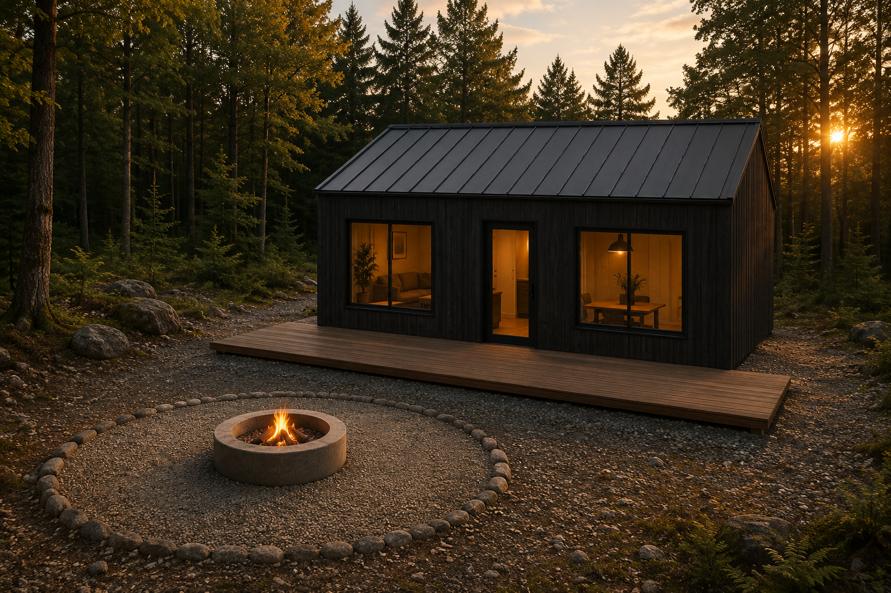 |

**Planning range:** contractor +$4k-$9k; owner-builder +$1.5k-$4k.

**Stage gate:** confirm actual grade, drainage, vegetation clearance, seasonal fire restrictions, emergency extinguishing access, and the exact fire-ring location before installing permanent work.

---

## Stage 4 - Bathhouse and connecting deck

Add the 16 x 16 ft bathhouse west of the firepit and extend a broad deck connection from the principal home. Keep the east sauna/shower facade facing the courtyard, with glazing on its northern portion and a solid southern shower-side portion.

| Fixed-frame plan | Illustrative high-fidelity view |
|---|---|
| 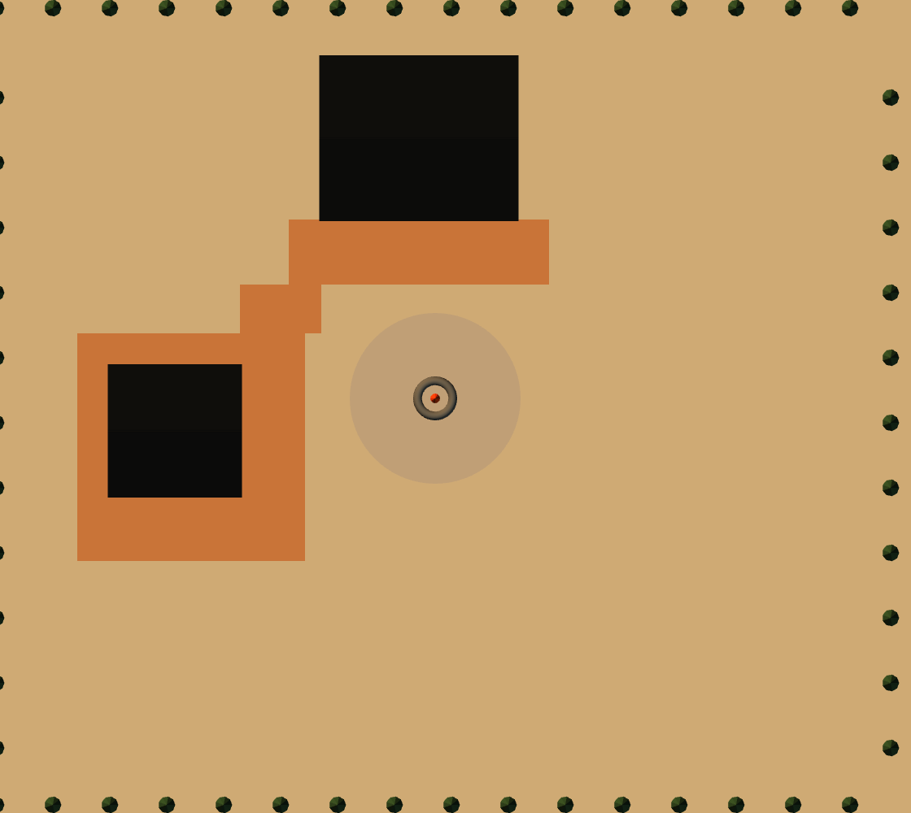 | 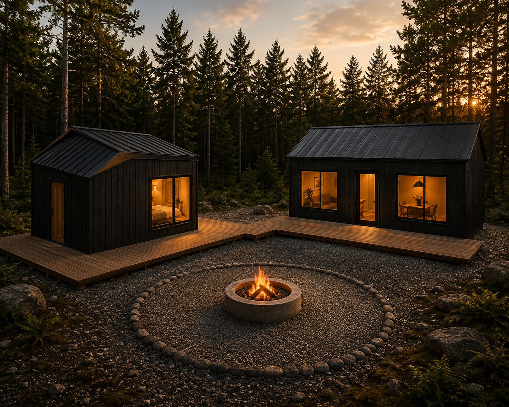 |

**Planning range:** contractor +$155k-$225k; owner-builder +$82k-$125k.

**Stage gate:** confirm the bathhouse as an allowed accessory use and resolve plumbing/septic, sauna equipment, ventilation, waterproofing, freeze protection, entry, egress, and deck/fire-separation details.

---

## Stage 5 - Courtyard seating and hot/cold bathing

Add six seating positions around the firepit, the compact cold plunge east of the bathhouse’s shower-side wall, and the wood-fired hot tub south and slightly west of the plunge. Preserve the sauna glazing and keep both vessels integrated with one enveloping bathhouse deck.

| Fixed-frame plan | Illustrative high-fidelity view |
|---|---|
| 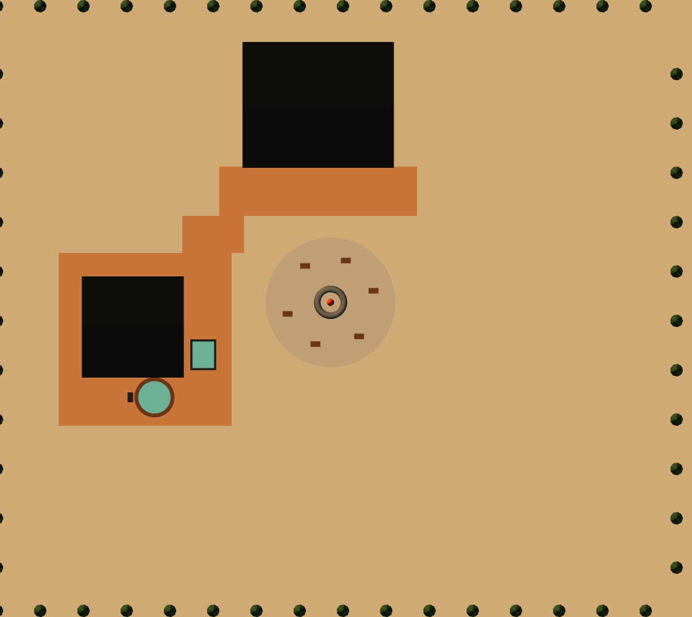 | 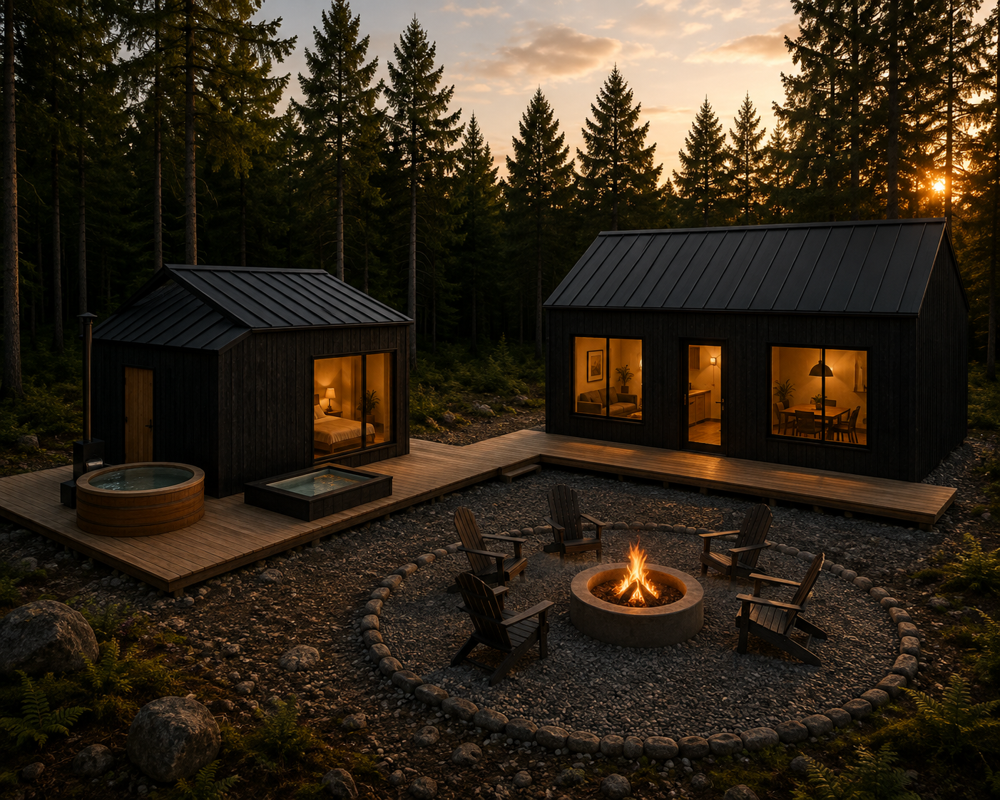 |

**Planning range:** contractor +$20k-$40k; owner-builder +$13k-$25k.

**Stage gate:** record water depths and selected equipment, then resolve pool/spa barriers or compliant covers, alarms, electrical bonding, drainage/discharge, heater/chimney clearance, slip resistance, and winter operation.

---

## Stage 6 - Detached ADU and south deck

Add the approximately 22 x 20 ft / 440 sf detached ADU to the southeast. It is intentionally close in scale to the principal home and includes a complete kitchen, full bathroom, HVAC, electricity, and independent living capability.

| Fixed-frame plan | Illustrative high-fidelity view |
|---|---|
| 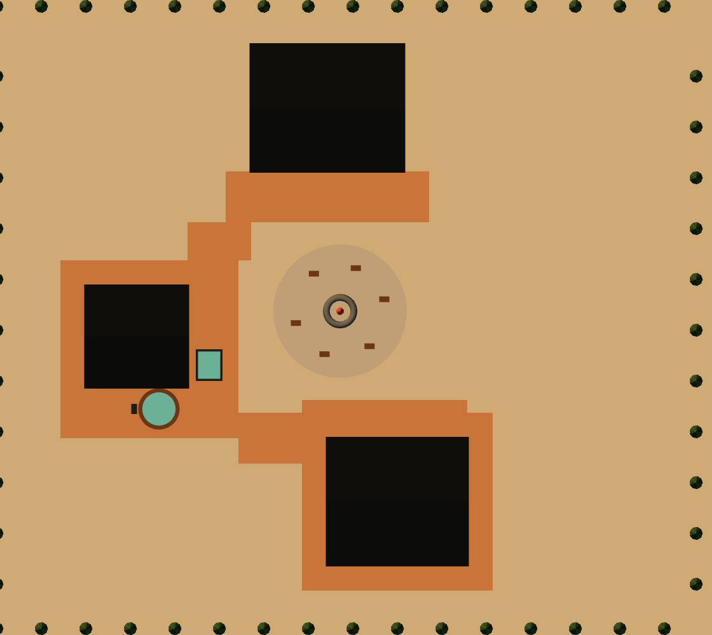 | 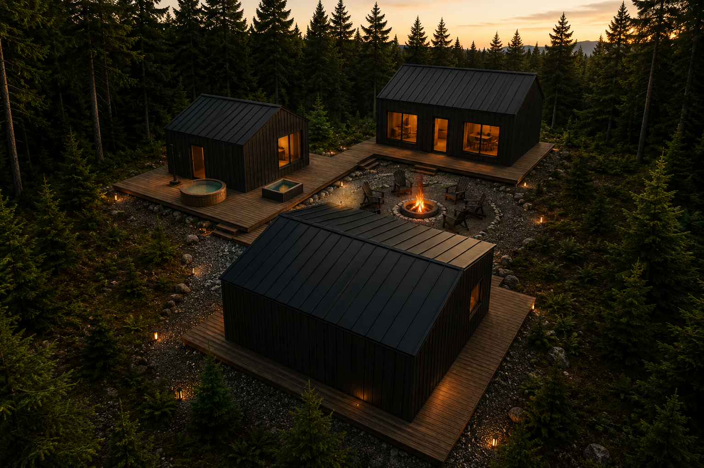 |

**Planning range:** contractor +$160k-$250k; owner-builder +$90k-$150k.

**Stage gate:** do not rely solely on the county ADU summary. Obtain the Town’s written approval path, including whether the hypothetical-subdivision rule applies to the shown close arrangement, and confirm septic, water, utilities, parking, access, and site-plan requirements.

---

## Stage 7 - Guest sleeping cabin and deck

Add the 16 x 12 ft / 192 sf guest cabin between the bathhouse and ADU. The intended version has no kitchen but includes a compact bathroom, electricity, heating/cooling, appropriate emergency escape, and smoke/CO protection.

| Fixed-frame plan | Illustrative high-fidelity view |
|---|---|
| 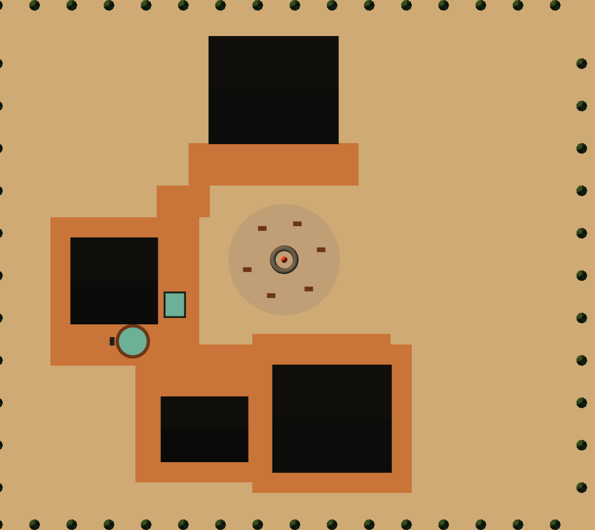 | 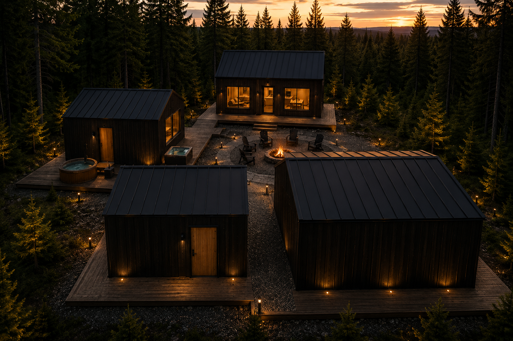 |

**Planning range:** contractor +$65k-$115k; owner-builder +$35k-$65k.

**Stage gate:** obtain written confirmation that this occupied, plumbed sleeping use is allowed as an accessory building. At 192 sf and with sleeping occupancy, it is not the optional ≤144 sf tool/storage/playhouse permit-exemption concept in 19 NYCRR Part 1203.

---

## Stage 8 - Outdoor kitchen and final deck links

Complete the east side with a covered approximately 18 x 16 ft open-air kitchen/bar pavilion. Its open face points west toward the courtyard and includes grill, smoker, prep counters, bar seating, lighting, and outlets. Final broad deck links close the circulation loop without moving earlier elements.

| Fixed-frame plan | Illustrative high-fidelity view |
|---|---|
|  |  |

**Planning range:** contractor +$45k-$80k; owner-builder +$25k-$45k.

**Stage gate:** resolve structure, foundations, weather/snow exposure, gas and solid-fuel appliance clearances, ventilation or hood requirements, electrical, water/waste if added, fire protection, and winterization. Preserve the pavilion as an accessory outdoor-living use with no sleeping program.

---

## Implementation strategy

### Before land purchase

- Obtain the deed/tax map, current boundary and topographic survey, title/easement review, and road/right-of-way status.
- Obtain the existing septic approval, design, as-built, maintenance record, approved bedrooms/design flow, and reserve area.
- Confirm potable-water feasibility and utility capacity; do not treat a seasonal stream as a residential water source.
- Screen flood zones, wetlands, protected streams and buffers, elevation, steep slopes, watershed requirements, and existing clearing limits.
- Present the full Stage 8 concept to Hardenburgh for written pre-application feedback.
- Refresh land, site-work, design, permit, utility, structure, and contingency costs.

### Before Stage 1 construction

- Translate the conceptual model into surveyed parcel coordinates.
- Lock access, grading/drainage, septic/well, utility service, fire access, snow storage, and the final building/deck envelopes.
- Decide the foundation and utility strategy for every later phase.
- Install approved sleeves, capped lines, and spare conduit during early trenching where doing so avoids future disturbance.
- Create a phase plan that allows each occupied component to receive its required certificate before use.

### During every stage

1. Reconfirm source assumptions and permit scope.
2. Update the master geometry before producing beauty images.
3. Review Stage 8 for downstream conflicts, then review the immediate stage.
4. Record actual cost, product, permit, and as-built information as new sources.
5. Update the affected proposal sections and rebuild the assembled document.

### Procurement posture

Use contractor-led delivery where sequencing, inspection, structural, mechanical, electrical, plumbing, septic, well, or life-safety risk is high. Reserve owner-performed work for scopes the owner can execute legally, safely, and without undermining warranties, schedule, or inspection access. The owner-builder budget is a strategy, not an assumption that licensed work can be self-performed.

---

## Regulatory and approval path

The legal concept remains plausible but unresolved. The current working framing is one principal dwelling, a detached ADU pursued through the route identified by Ulster County, a permitted no-kitchen accessory sleeping cabin, and accessory wellness/outdoor-living structures.

### Findings that shape the plan

- Hardenburgh’s posted law uses one town-wide residential district and lists basic dimensional standards, but natural-resource rules can materially change capacity and placement.
- More than one principal residential building must satisfy area, bulk, and subdivision rules as if separate lots were created.
- Ulster County’s current guide says Hardenburgh ADUs are allowed by conditional-use permit, while the posted older town PDFs do not expressly define that route.
- The local zoning schedule and 2024 permit form show conflicting front/side setback numbers.
- The guest cabin cannot rely on the optional ≤144 sf shed/playhouse permit-exemption concept: it is 192 sf and intended for sleeping.
- The 480 sf principal home and 440 sf ADU are not “tiny houses” under the 2025 New York code’s ≤400 sf definition.
- Hot tubs, spas, and other vessels capable of holding more than 24 inches of water fall within current residential-code pool/spa provisions.

Until resolved, reserve a conservative 25 ft front, 30 ft side, and 50 ft rear working envelope, but do not treat it as a zoning determination.

Read the dated [Hardenburgh zoning analysis](../legal/analysis/01-hardenburgh-zoning.md), [building-code analysis](../legal/analysis/02-building-code-and-permits.md), [component approval map](../legal/analysis/03-project-application.md), and [questions for authorities](../legal/analysis/04-questions-for-authorities.md). The underlying authorities are cataloged in [legal sources](../legal/sources/SOURCE_CATALOG.md).

### Required confirmation

The owner should seek written answers from the Town before relying on the full layout, then involve Ulster County and licensed site/building professionals as required. Permit and legal research should be refreshed at each stage because codes, local rules, forms, interpretations, and parcel conditions can change.

---

## Open decisions, source basis, and caveats

### Decisions to make next

1. Is the sample parcel still a relevant acquisition target, or only a site-character example?
2. What is the verified buildable envelope after survey, resource mapping, septic/well, access, and Town review?
3. Can the ADU and guest cabin be approved in the shown arrangement and use pattern?
4. Which stages are essential, optional, or likely to be removed for budget?
5. What level of winter use, accessibility, rental use, resilience, and off-grid capability should drive design?
6. Which cost scopes will be professionally bid, owner-performed, or deferred?
7. Which image family is accepted for publication, and what visual changes remain?

### Core design sources

- [Machine-readable cameras and geometry](../sources/data/cameras-and-geometry.json)
- [Crude procedural model](../sources/models/crude-site-model/Catskills_Compound_Master_3D_Model_appblock_v13.html)
- [Intermediate renderer](../sources/models/intermediate-renderer/render_intermediate_stages.py)
- [Stage image sources](../sources/images/stages)
- [Bathhouse sources](../sources/images/bathhouse)
- [Archived prior proposal](../sources/prior-proposals/catskills_compound_development_proposal_rev3.pdf)

### Regulatory sources

The research archive includes the Town of Hardenburgh zoning law, official zoning index, 2024 permit packet, Ulster County ADU guidance, 19 NYCRR Part 1203, and the 2025 Residential Code of New York State. See the [source catalog](../legal/sources/SOURCE_CATALOG.md) for publisher URLs, dates, and authority notes.

### Caveat

This proposal is a living feasibility and visualization document. Actual legality, permitting, site placement, title, septic capacity, well location, structural design, energy compliance, fire safety, grading, drainage, utility service, construction cost, schedule, insurance, and tax treatment require current confirmation from the relevant authorities and qualified professionals. Dimension-controlled model outputs express site-plan intent; photorealistic images express atmosphere and material intent.
